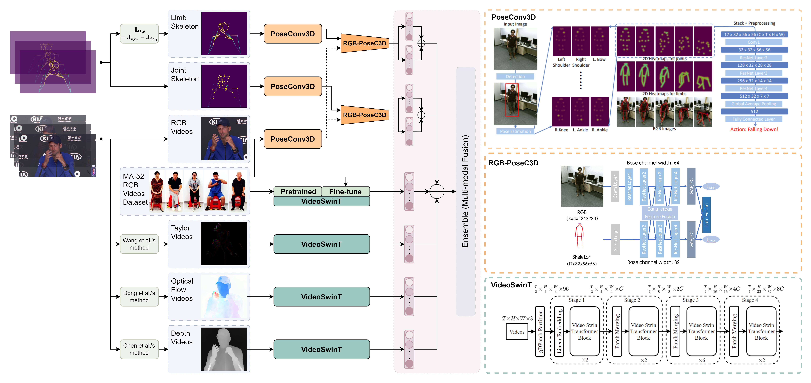

<div align="center">
<h1>MM-Gesture: Towards Precise Micro-Gesture Recognition through Multimodal Fusion</h1>

[**Jihao Gu**](https://scholar.google.com/citations?hl=en&user=fSWwq3AAAAAJ)<sup>1</sup>, [**Fei Wang**](https://scholar.google.com/citations?user=sdqv6pQAAAAJ)<sup>2,5</sup>, [**Kun Li**](https://scholar.google.com/citations?user=UQ_bInoAAAAJ)<sup>3 :email: </sup>, [**Yanyan Wei**](https://scholar.google.com/citations?user=pjEvug0AAAAJ)<sup>2</sup>, [**Zhiliang Wu**]()<sup>3</sup>, and [**Dan Guo**](https://scholar.google.com/citations?user=DsEONuMAAAAJ)<sup>2,4,5</sup>  

<sup>1</sup> University College London (UCL), Gower Street, London, WC1E 6BT, UK  
<sup>2</sup>School of Computer Science and Information Engineering, School of Artificial Intelligence, Hefei University of Technology (HFUT)  
<sup>3</sup>ReLER, CCAI, Zhejiang University, China  
<sup>4</sup>Key Laboratory of Knowledge Engineering with Big Data (HFUT), Ministry of Education  
<sup>5</sup>Institute of Artificial Intelligence, Hefei Comprehensive National Science Center, China  

:trophy:**Champion Solution for [Micro-gesture Classification](https://www.kaggle.com/competitions/the-3rd-mi-ga-ijcai-challenge-track-1/overview) in [3rd MiGA @ IJCAI 2025](https://cv-ac.github.io/MiGA2025/)**

</div>

---

<p align="center">
  <a href="https://arxiv.org/abs/2507.08344" target="_blank"></a>
  <a href="https://huggingface.co/datasets/Geo2425/iMiGUE_SRTFD" target="_blank"></a>
  <a href="https://drive.google.com/drive/folders/1roxllRgFxS6Iz6osShYij5G8miu924DL?usp=drive_link" target="_blank"></a>
  <a href="https://visitor-badge.laobi.icu/badge?page_id=momiji-bit.MM-Gesture&left_color=green&right_color=red" target="_blank"></a>
  <a href="https://img.shields.io/github/issues-raw/momiji-bit/MM-Gesture?color=%23FF9600" target="_blank"></a>
  <a href="https://img.shields.io/github/stars/momiji-bit/MM-Gesture?style=flat&color=yellow" target="_blank"></a>
</p>

🎉 The generated `ensemble/prediction.zip`  represents our **final submission**, achieving an impressive 🏆 **Top-1 Accuracy of 73.213%**! 🌟



## 📚 0. Table of Contents

- [📦 1. Installation](#-1-installation)
- [📂 2. Data preparation](#-2-data-preparation)
  - [🔽 2.1 Download our pre-processed dataset (Recommend)](#-21-download-our-pre-processed-dataset-recommend)
  - [⚙️ 2.2 Process dataset by yourself [Optional]](#%EF%B8%8F-22-process-dataset-by-yourself-optional)
    - [2.2.1 Download MiGA'25 Official Dataset (Track 1)](#221-download-miga25-official-dataset-track-1)
    - [2.2.2 Generate Skeleton Data](#222-generate-skeleton-data)
    - [2.2.3 Generate RGB Videos](#223-generate-rgb-videos)
    - [2.2.4 Generate Taylor Videos](#224-generate-taylor-videos)
    - [2.2.5 Generate Optical Flow Videos](#225-generate-optical-flow-videos)
    - [2.2.6 Generate Depth Videos](#226-generate-depth-videos)
- [🏋️‍♂️ 3. Training & Testing](#%EF%B8%8F%EF%B8%8F-3-training--testing)
  - [3.1 PoseConv3D](#31-poseconv3d)
  - [3.2 VideoSwinT](#32-videoswint)
- [💥 4. Ensemble (Multi-modal Fusion)](#-4-ensemble-multi-modal-fusion)
- [🙏 5. Acknowledgement](#-5-acknowledgement)
- [📧 6. Contact](#-6-contact)


## 📦 1. Installation

```bash
git clone https://github.com/momiji-bit/MM-Gesture
cd MM-Gesture

```

## 📂 2. Data preparation

### 🔽 2.1 Download our pre-processed dataset (Recommend)

🔐 To facilitate your access to our preprocessed video data, you can download it directly from [HuggingFace](https://huggingface.co/datasets/Geo2425/iMiGUE_SRTFD). 

🔐 To comply with the dataset’s usage policy, we have restricted access to the processed files. Please request access through HuggingFace, and we will approve it promptly.


```bash
# If you are in China, please use hfd to accelerate the download.
cd dataset
sudo apt update
sudo apt install aria2

wget https://hf-mirror.com/hfd/hfd.sh
chmod a+x hfd.sh
export HF_ENDPOINT=https://hf-mirror.com
./hfd.sh Geo2425/iMiGUE_SRTFD --dataset

# If you are not in China, just download the pre-processed dataset.
cd dataset 
pip install huggingface_hub
huggingface-cli login
mkdir -p ./iMiGUE_SRTFD
huggingface-cli download Geo2425/iMiGUE_SRTFD --repo-type dataset --local-dir ./iMiGUE_SRTFD
```

```bash
unzip ./iMiGUE_SRTFD/Skeleton.zip -d .
unzip ./iMiGUE_SRTFD/RGB.zip -d .
unzip ./iMiGUE_SRTFD/Taylor.zip -d .
unzip ./iMiGUE_SRTFD/Flow.zip -d .
unzip ./iMiGUE_SRTFD/Depth.zip -d .

mkdir RGB/clips
cp -r RGB/train/* RGB/clips
cp -r RGB/val/* RGB/clips
cp -r RGB/test/* RGB/clips

# rm -r ./iMiGUE_SRTFD
cd ..

```

### ⚙️ 2.2 Process dataset by yourself [Optional]

If you've already downloaded the preprocessed data, feel free to skip this step.

```bash
cd dataset
mkdir Skeleton RGB Taylor Flow Depth MiGA

```

#### 2.2.1 Download MiGA'25 Official Dataset (Track 1) 

Download here: [Kaggle MiGA Challenge Track 1](https://www.kaggle.com/competitions/the-3rd-mi-ga-ijcai-challenge-track-1/data)

You just need to download the following files:

- 1️⃣ `imigue_skeleton_phase1.zip` → `imigue_data_phase1`
- 2️⃣ `imigue_rgb_phase1.zip` → `imigue_rgb_phase1`
- 3️⃣ `imigue_skeleton_phase2.zip` → `imigue_data_phase2` 🔒
- 4️⃣ `imigue_rgb_phase2.zip` → `imigue_rgb_phase2` 🔒

Or use these commands to download and unzip:

```bash
cd MiGA

# 🏋️‍♂️ Train and Validation dataset
wget https://miga3.a3s.fi/imigue_skeleton_phase1.zip
wget https://miga3.a3s.fi/imigue_rgb_phase1.zip
unzip imigue_skeleton_phase1.zip
unzip imigue_rgb_phase1.zip

# 🧪 Test dataset
# 🔒 Note: Links might expire based on organizer’s access policy.
wget https://miga3.a3s.fi/imigue_skeleton_phase2.zip
wget https://miga3.a3s.fi/imigue_rgb_phase2.zip
unzip imigue_skeleton_phase2.zip
unzip imigue_rgb_phase2.zip

```

#### 2.2.2 Generate Skeleton Data

To generate the skeleton data, simply run the code provided in the Jupyter notebook:

```bash
Open and execute `dataset/tools/processing_Skeleton.ipynb`.
```

#### 2.2.3 Generate RGB Videos

For RGB video generation, use the provided Jupyter notebook:

```bash
Open and execute `dataset/tools/processing_RGB.ipynb`.
```

#### 2.2.4 Generate Taylor Videos

To generate Taylor-encoded videos:

```bash
cd ../tools

python taylor.py ../RGB/train ../Taylor/train
python taylor.py ../RGB/val ../Taylor/val
python taylor.py ../RGB/test ../Taylor/test
```

#### 2.2.5 Generate Optical Flow Videos

We use [memflow](https://github.com/memflow/memflow) for optical flow generation.

1. **Setup**
    Follow memflow’s official instructions to install dependencies and download pretrained models.
2. **Optimized Execution**
    Use the custom script `inference_mp4.py` for efficient GPU utilization.
3. **Run the following commands**:

```bash
python inference_mp4.py \
  --name MemFlowNet \
  --stage things \
  --restore_ckpt ckpts/MemFlowNet_things.pth \
  --input_dir ../../MiGA/RGB/train \
  --output_dir ../../MiGA/Flow/train

python inference_mp4.py \
  --name MemFlowNet \
  --stage things \
  --restore_ckpt ckpts/MemFlowNet_things.pth \
  --input_dir ../../MiGA/RGB/val \
  --output_dir ../../MiGA/Flow/val

python inference_mp4.py \
  --name MemFlowNet \
  --stage things \
  --restore_ckpt ckpts/MemFlowNet_things.pth \
  --input_dir ../../MiGA/RGB/test \
  --output_dir ../../MiGA/Flow/test
```

#### 2.2.6 Generate Depth Videos

We use [Video-Depth-Anything](https://github.com/DepthAnything/Video-Depth-Anything) to generate depth videos.

1. **Setup**
    Follow the official instructions to configure the environment and download pretrained models.
2. **Optimized Execution**
    Use the custom script `run_dir.py` for efficient GPU utilization.
3. **Run the following commands**:

```bash
# For training data
python3 run_dir.py \
  --input_dir ../../MiGA/RGB/train \
  --output_dir ../../MiGA/Depth/train \
  --encoder vits \
  --grayscale \
  --procs_per_gpu 2

# For validation data
python3 run_dir.py \
  --input_dir ../../MiGA/RGB/val \
  --output_dir ../../MiGA/Depth/val \
  --encoder vits \
  --grayscale \
  --procs_per_gpu 2

# For test data
python3 run_dir.py \
  --input_dir ../../MiGA/RGB/test \
  --output_dir ../../MiGA/Depth/test \
  --encoder vits \
  --grayscale \
  --procs_per_gpu 2
```


## 🏋️‍♂️ 3. Training & Testing

✨ **Pre-trained models are available for download [here](https://drive.google.com/drive/folders/1roxllRgFxS6Iz6osShYij5G8miu924DL?usp=drive_link).** 📥🎯

| Model (Size)                 | Modality     | Link                                                         |
| ---------------------------- | ------------ | ------------------------------------------------------------ |
| PoseConv3D                   | Joint        | [Download](https://drive.google.com/drive/folders/1LaR2_A-I7M0RhnxCThB3DCOQWd7wnHa7?usp=drive_link) |
| PoseConv3D                   | Limb         | [Download](https://drive.google.com/drive/folders/1w7nQFvfZgUR3E9TZPB-wYWj7d3Sr8xet?usp=drive_link) |
| PoseConv3D                   | RGB+Joint    | [Download](https://drive.google.com/drive/folders/1n8zEyO9_4k7pCMtUWzn10TkZ0VuvB4f0?usp=drive_link) |
| PoseConv3D                   | RGB+Limb     | [Download](https://drive.google.com/drive/folders/1ElTK8M7KvIWKesmTGaEHyrnVDmXp75RM?usp=drive_link) |
| VideoSwinT (Base/Small/Tiny) | RGB          | [Download](https://drive.google.com/drive/folders/1_d_QzHOnQkX0t2y0clCNbS9mN6aNvF6K?usp=drive_link) |
| VideoSwinT (Small/Tiny)      | RGB*         | [Download](https://drive.google.com/drive/folders/1HlIhvC7voFI0ckL2niRVQiqMkCFt14Yn?usp=drive_link) |
| VideoSwinT (Base/Small/Tiny) | Taylor       | [Download](https://drive.google.com/drive/folders/1gLbqScavIe2Mb0g-gHsPC-N11v2dzNFO?usp=drive_link) |
| VideoSwinT (Base)            | Optical Flow | [Download](https://drive.google.com/drive/folders/1ePhPSeNzkLDoNZqm2faTVyxJtMyQlYbR?usp=drive_link) |
| VideoSwinT (Base/Small)      | Depth        | [Download](https://drive.google.com/drive/folders/1Va6CLjkO1WC6O_Rnt2Y-Ub0-74FesNG8?usp=drive_link) |

### 3.1 PoseConv3D

```bash
# Install dependencies
conda env create -f pyskl_environment.yml -y
conda activate pyskl  # Or: source activate pyskl
cd pyskl
```

Then, run the code in `pyskl/RUN.ipynb` for training and testing.

### 3.2 VideoSwinT

```bash
# Install dependencies
conda env create -f openmmlab_environment.yml -y
conda activate openmmlab  # Or: source activate openmmlab
cd mmaction2
```

Then, run the code in `mmaction2/RUN.ipynb` for training and testing.

## 💥 4. Ensemble (Multi-modal Fusion)

We provide a script for combining **six modalities** (*Joint, Limb, RGB, Taylor, Optical Flow, Depth*) to leverage their complementary strengths and improve accuracy:

- Run `ensemble/ensemble.py` to generate the final competition results.

## 🙏 5. Acknowledgement

This code began with [PYSKL](https://github.com/kennymckormick/pyskl/tree/main) and [mmaction2](https://github.com/open-mmlab/mmaction2) toolbox. We thank the developers for doing most of the heavy-lifting. 

If you found this code useful, please consider citing:

```
@article{gu2025mm,
  title={MM-Gesture: Towards Precise Micro-Gesture Recognition through Multimodal Fusion},
  author={Gu, Jihao and Wang, Fei and Li, Kun and Wei, Yanyan and Wu, Zhiliang and Guo, Dan},
  journal={arXiv preprint arXiv:2507.08344},
  year={2025}
}

@article{guo2024benchmarking,
  title={Benchmarking Micro-action Recognition: Dataset, Methods, and Applications},
  author={Guo, Dan and Li, Kun and Hu, Bin and Zhang, Yan and Wang, Meng},
  journal={IEEE Transactions on Circuits and Systems for Video Technology},
  year={2024},
  volume={34},
  number={7},
  pages={6238-6252}
}

@misc{2020mmaction2,
    title={OpenMMLab's Next Generation Video Understanding Toolbox and Benchmark},
    author={MMAction2 Contributors},
    howpublished = {\url{https://github.com/open-mmlab/mmaction2}},
    year={2020}
}
 
```


## 📧 6. Contact

For any questions, feel free to contact: Dr. Kun Li (kunli.hfut@gmail.com) and Mr. Jihao Gu (jihao.gu.23@ucl.ac.uk).
